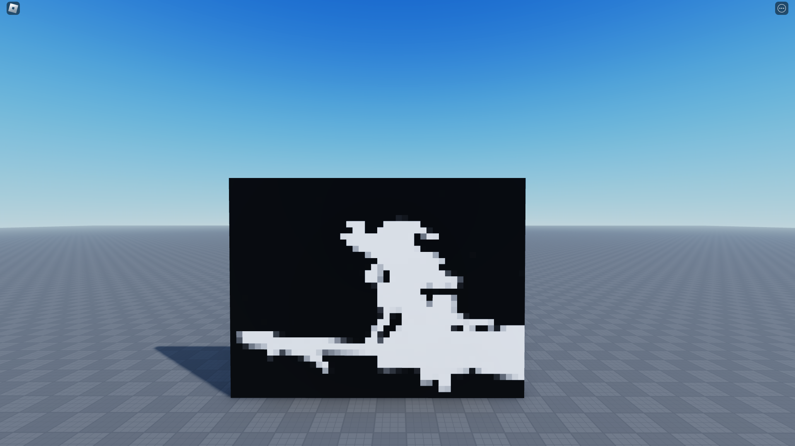

# bad-apple-txt

- Basically the same as bad-apple-rbx except I rewrote the entire thing to use a text file instead because it's way more efficient and the alternative method I was using didn't make a lot of sense anyway
- For the uninitiated:
  - Clone the repository
  - Run server.py in your IDE of choice
  - Open ba_dev.rbxl and click play
  - Follow the on screen prompt to begin video playback

### Notes

- Required libraries: opencv-python, waitress, flask
- Make sure you have these installed before you attempt to run server.py
- For people who want a technical explanation of what's happening:
  - Flask and waitress are used to locally host a web server with the api endpoint '/txt'. This is the endpoint that your studio instance will use to get the video data
  - Video data is gathered and serialised using OpenCV and RLE Compression, before being written to a text file
  - Roblox game makes a request to this end point (with configurable size parameters) in order to get the video data, before decoding and displaying it onscreen

